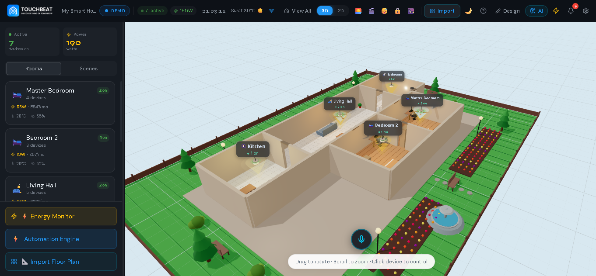
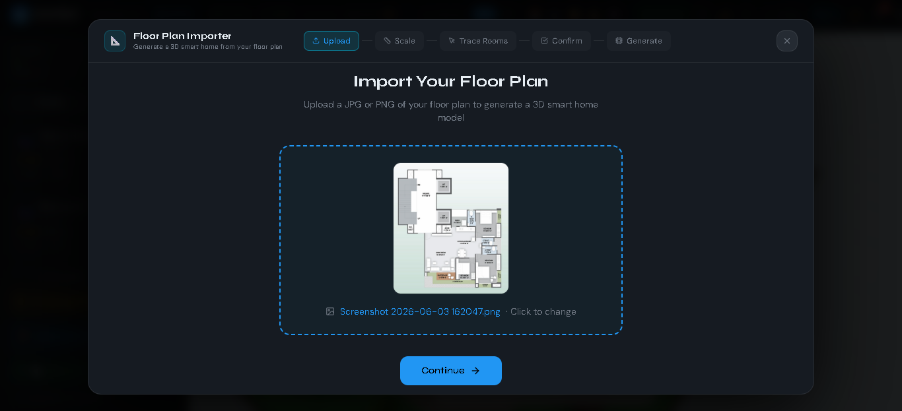
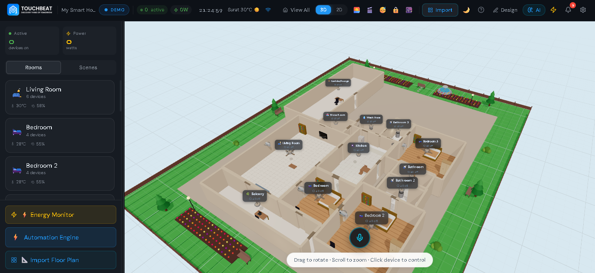
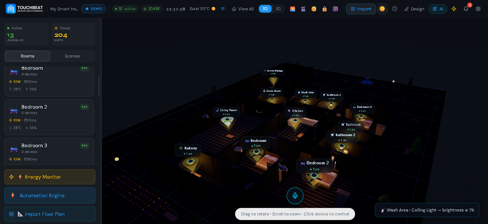
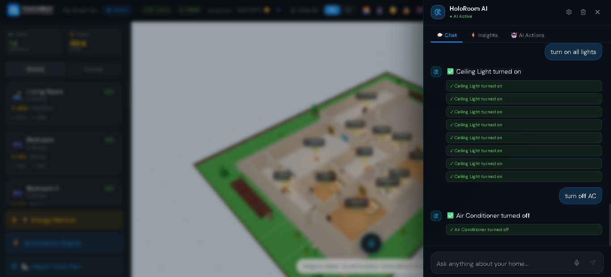
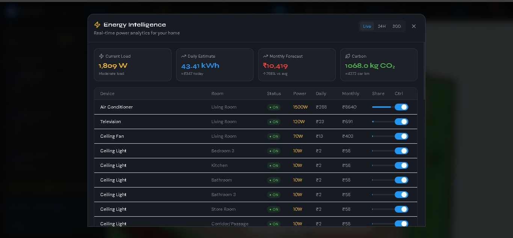

<div align="center">

# 🏠 HoloRoom

### A 3D Smart Home Dashboard that actually feels like the future

**Built for [Touchbeat.in](https://touchbeat.in) · Internship Project**

[](https://holoroom-touchbeat.vercel.app/)
[](https://holoroom-touchbeat-backend.onrender.com)
[](https://react.dev)
[](https://threejs.org)
[](https://fastapi.tiangolo.com)
[](https://www.typescriptlang.org)

</div>

---

## What is HoloRoom?

Most smart home apps look like a settings menu. A list of toggles, maybe a grid of icons. You flip a switch, something happens somewhere in your house. It works — but it doesn't feel like anything.

HoloRoom is built on a different idea: **what if you could actually see your home?**

The whole house is rendered in 3D. Lights glow when they're on. Ceiling fans spin, and if you crank the speed up, the blades actually spin faster. The AC unit sits on the wall where it's supposed to be. You click on any device, a control panel slides out, and you adjust it — brightness, temperature, fan speed, whatever it supports. Or you don't click anything. You just open the AI panel and say "turn off everything except the bedroom AC" — and it does that.

The AI isn't a chatbot sitting next to the dashboard that gives you suggestions. It's wired directly into the home's state. When it tells you it turned something off, it actually called the function that turned it off. You can watch the 3D scene update in real time as you talk to it.

This was built as my internship project for [Touchbeat.in](https://touchbeat.in), an Indian smart home company. The brief was to build something that could demonstrate smart home control in a way that was genuinely impressive to show — not just functional. I think it got there.

---

## Live Demo

🔗 **[holoroom-touchbeat.vercel.app](https://holoroom-touchbeat.vercel.app/)**

No login required. The demo home comes pre-loaded with 6 rooms and all their devices, so you can start exploring the moment you open it.

> **Heads up on load time:** The AI backend runs on Render's free tier, which spins down after inactivity. The very first AI request after a quiet period can take 20–30 seconds to wake up — that's just cold start, not a bug. Once it's awake, everything responds instantly.

---

## Features

### 3D Home Visualization

The core of HoloRoom is a fully interactive 3D rendering of your home, built with Three.js and React Three Fiber. This isn't a top-down floor plan view or a diagram — it's a proper 3D space you can orbit around, zoom into, and click through.

Each device in the house has its own 3D model placed where it would actually be:

- **Ceiling lights** that emit a soft glow when on, with adjustable color temperature (warm to cool white)
- **Ceiling fans** with rotating blades — slow at speed 1, noticeably faster at speed 5
- **Wall-mounted ACs** positioned on the walls of the rooms that have them
- **Flat-screen TVs** mounted or standing in the living room
- **Geysers** in the bathroom
- **Exhaust fans** in the kitchen and balcony
- **Smart plugs** on the walls

Turn a device on and the 3D model lights up or starts animating. Turn it off and it goes dark or stops. Everything updates in real time without any page reload.

You can orbit the entire house with your mouse, zoom into individual rooms, or click the preset camera buttons to jump directly to a room view. Navigation is smooth because each room has a saved camera position that frames it properly.

**The default home layout:**

| Room | Devices |
|------|---------|
| Master Bedroom | Ceiling Light · Ceiling Fan · Air Conditioner · Smart Plug |
| Bedroom 2 | Ceiling Light · Ceiling Fan · Smart Plug |
| Living Hall | Ceiling Light · Ceiling Fan · Television · 2× Smart Plugs |
| Kitchen | Ceiling Light · Exhaust Fan · Smart Plug |
| Bathroom | Ceiling Light · Geyser |
| Balcony | Ceiling Light · Exhaust Fan |

Each room also shows its current temperature and humidity readings in the sidebar, and the floor and wall colors are different per room so they look distinct in the 3D view.

---

### Device Controls

Every device type has its own set of controls, surfaced in a slide-out panel when you click on it in the 3D view or in the sidebar.

| Device | What you can control |
|--------|---------------------|
| 💡 Ceiling Light | On/Off · Brightness slider (1–100%) · Color Temperature |
| 🌀 Ceiling Fan | On/Off · Speed selector (1–5) |
| ❄️ Air Conditioner | On/Off · Temperature (16–30°C) · Mode (Cool / Heat / Fan / Auto / Dry) |
| 📺 Television | On/Off · Volume (0–100) |
| 🚿 Geyser | On/Off · Timer |
| 🔌 Smart Plug | On/Off |
| 💨 Exhaust Fan | On/Off |

Changes apply instantly to the 3D scene and get reflected across the entire dashboard — sidebar, energy monitor, AI context, everywhere.

---

### HoloRoom AI Copilot

The AI panel is probably the part of this project I'm most proud of, because it actually does what you tell it to do.

Under the hood, it uses `llama-3.3-70b-versatile` via the Groq API, with **8 registered tool functions** that map directly to home state mutations. When you say "dim the bedroom light to 40%", the AI calls the `control_device` tool with the right parameters and the light actually dims. There's no intermediate layer, no confirmation UI you have to click through — it executes and tells you what it did.

**What the AI can handle:**

- Turn individual devices on or off by name: *"turn off the kitchen exhaust fan"*
- Adjust specific settings: *"set the AC to 22 degrees cool mode"*, *"dim the living room lights to 30%"*
- Control all devices in a room at once: *"turn off everything in the bedroom"*
- Control the whole house: *"I'm heading out, turn everything off"*
- Activate scenes by name or vibe: *"cinema vibes"*, *"put on sleep mode"*
- Create entirely new scenes from a description: *"make a study mode: bright lights, no TV, AC at 22"*
- Build automation rules in plain English: *"turn on the geyser at 6 AM every morning"*
- Analyze your energy usage with context: *"which devices are costing me the most this month?"*
- Spot anomalies: *"the geyser's been on for over an hour"*, *"your total power just crossed 3000W"*

Natural language works properly here. *"It's getting warm"* will turn the fan on. *"Lock up the house"* triggers Away Mode. *"I want to watch a movie"* activates Movie Night. You don't have to remember any command syntax.

**Three tabs in the Copilot panel:**

**Chat** — The main conversational interface. Type or speak naturally. The AI maintains context across the conversation so you can say things like "now change the temperature to 24" and it knows which AC you're talking about.

**Insights** — AI-generated energy analysis triggered on demand. This gives you:
- Which devices are consuming the most power right now
- Estimated monthly electricity bill in ₹ (based on your configured rate)
- How you compare to the average Indian household (₹1,200/month baseline)
- Monthly CO₂ footprint estimate
- Specific, actionable savings suggestions (e.g., *"raising the AC from 22°C to 26°C saves about ₹240/month"*)

**AI Actions** — Quick-access buttons for common commands so you don't have to type them out. One tap to run the most-used scenarios.

**Voice Commands:**

There's a microphone button that ties into the Web Speech API. Click it, speak naturally — same AI, same capabilities, just no typing. *"Turn off the bedroom lights"* → done. No wake word needed.

**Streaming responses:**

The AI streams its replies via Server-Sent Events from the FastAPI backend, so you see the response building in real time rather than waiting for a complete answer to arrive.

---

### Scene System

Scenes are saved sequences of device actions that play out with timed delays — like a routine you can activate with a single tap.

**Built-in scenes:**

| Scene | What it does |
|-------|-------------|
| 🌅 Good Morning | Master bedroom light → 80% · Fan → low · Kitchen light on · Geyser on · Living hall light on |
| 🎬 Movie Night | Living hall lights off · Bedroom light → 15% · TV on · AC → 24°C cool |
| 😴 Sleep Mode | All lights off · TV off · All fans off · Bedroom AC → 26°C |
| 🔒 Away Mode | Everything in the entire house turns off |
| 🌙 Night Mode | Reduces brightness across all active rooms · Fans to low speed |

You can also create completely custom scenes through the AI. Describe what you want — *"make a focus mode: bright kitchen light, no TV, bedroom fan on 2, AC at 22"* — and it builds the scene, saves it with a name, and it shows up in the scenes panel ready to activate anytime.

Activating a scene plays the device actions in sequence with the programmed delays, so things like "lights fade in slowly" actually work the way you'd expect.

---

### Automation Engine

Automations let HoloRoom do things automatically without you having to remember. You define the rules once, and the engine runs them in the background forever.

**Trigger types you can use:**

- **Time-based** — *"At 11 PM every night, activate Sleep Mode"*
- **Device state change** — *"When the bedroom AC turns on, set the ceiling fan to speed 1"*
- **Energy threshold** — *"When total home power crosses 3000W, turn off the TV and smart plugs"*
- **Sun events** — Sunrise or sunset triggers with optional minute offsets

**What automations can do when triggered:**

- Control any specific device (on/off, set brightness, temperature, speed, volume)
- Activate a named scene
- Send a notification to the dashboard

**Automation templates that ship with HoloRoom:**

| Template | What it does | Default |
|----------|-------------|---------|
| Bedtime Routine | Sleep Mode at 11 PM daily | Enabled |
| AC + Fan Sync | When bedroom AC turns on → fan drops to speed 1 | Enabled |
| Energy Guard | When home crosses 3000W → TV and plugs off | Enabled |
| Morning Wake | Good Morning scene at 6:30 AM weekdays | Disabled |
| Away Saver | Everything off at 10 AM weekdays | Disabled |

You can edit any template, toggle them on or off, or build entirely new ones through the AI in plain English.

---

### Energy Monitor

The energy section is more than a live wattage number — it gives you enough context to actually understand and change your consumption.

**Live view:**
- Total home power right now in watts, color-coded (green under 1000W → amber → red above 2500W)
- Per-device breakdown sorted by consumption so the biggest culprits are obvious

**Bill estimates:**
- Monthly cost in ₹ based on your electricity rate (you can set this in Settings)
- Comparison against the average Indian household (₹1,200/month baseline)
- Monthly CO₂ footprint in kg

**Charts:**
- 24-hour area chart of power usage across the day, broken down by room
- 30-day daily kWh chart with cost in ₹ per day
- Room-by-room monthly cost bar chart showing which rooms are the most expensive

**Smart recommendations:**
Suggestions like "raising the AC from 22°C to 26°C saves ≈₹240/month" or "the geyser accounts for 34% of your bill — consider using a timer" — not generic tips, but things calculated from your actual usage data.

---

### Floor Plan Importer

If you want to use your actual home layout instead of the default one, there's a 5-step import wizard:

**Step 1 — Upload:** Drop in a PNG or JPG image of your floor plan.

**Step 2 — Scale:** Click two points you know the real distance between (like a wall you measured) to calibrate the tool to real-world units.

**Step 3 — Trace Rooms:** Click around the boundary of each room to draw a polygon over it. The tool shows your trace live on the image as you click.

**Step 4 — Name & Assign:** Give each traced room a name and a type (bedroom, kitchen, bathroom, living room, etc.). The type determines which device categories are offered when you add devices later.

**Step 5 — Generate:** Hit generate and HoloRoom converts your traced polygons into a 3D layout, calculating room adjacency and positioning rooms relative to each other to match your actual floor plan geometry.

---

### MQTT / WebSocket Connectivity

HoloRoom is built to connect to real hardware, not just simulate it. If you have an actual MQTT broker (like a Mosquitto instance running on your home network), you can configure it through the Broker Config panel:

- Broker host, port, username, password
- Topic prefixes for your device namespace

Once connected, the dashboard subscribes to device state topics and reflects real sensor data coming in from physical devices. State changes you make in the dashboard publish commands back to the broker.

If no broker is configured or the connection fails, the dashboard falls back to a built-in simulator that generates realistic device state fluctuations — so the demo always feels live even without real hardware behind it.

---

### Other Things Worth Knowing

**Device Scheduling** — Individual devices can have their own on/off schedules independent of automations. Set a device to turn on at 7 AM and off at 10 PM on specific days of the week.

**Favorites** — Mark any device as a favorite and it floats to the top of the sidebar for quick access. Useful for the things you touch constantly.

**Activity Log** — Every device action is timestamped and logged. The sidebar shows recent activity with sparklines so you can see at a glance what changed and when.

**Notification Panel** — Collects system events: automation triggers, energy alerts, AI action confirmations, anomaly warnings. Clears on demand.

**Onboarding Tour** — First-time visitors get a guided walkthrough that highlights each section of the UI and explains what it does. Built with Framer Motion so it flows nicely.

**Home Design Mode** — A built-in layout editor for adjusting room positions, colors, and device placements within the dashboard itself. Lets you customize the 3D layout without touching any code.

**Dark Theme** — The entire UI uses a deep space dark theme with cyan and purple accent colors throughout. All design tokens are CSS custom properties, which makes the theming consistent across every component.

---

## Tech Stack

### Frontend

| Technology | Version | What it's doing |
|-----------|---------|----------------|
| React | 19 | UI framework |
| TypeScript | 5.9 | Type safety across the entire codebase |
| Vite | 7 | Build tooling and dev server |
| Three.js | r184 | 3D rendering engine |
| React Three Fiber | 9 | React bindings for Three.js |
| @react-three/drei | 10 | Three.js helpers (OrbitControls, camera, etc.) |
| Zustand | 5 | State management — 8 separate stores |
| Framer Motion | 12 | UI animations and transitions |
| Recharts | 3 | Energy charts and graphs |
| Tailwind CSS | 4 | Utility-first styling |
| Lucide React | 1.17 | Icon library |
| date-fns | 4 | Date formatting for chart labels |

### Backend

| Technology | Version | What it's doing |
|-----------|---------|----------------|
| Python | 3.11+ | Runtime |
| FastAPI | 0.111+ | API framework |
| Groq SDK | 0.9+ | LLM API client |
| Uvicorn | 0.29+ | ASGI server |
| Pydantic | 2.7+ | Request and response validation |

### AI

- **Model:** `llama-3.3-70b-versatile` via [Groq](https://groq.com)
- **Tool calling:** 8 registered functions that map directly to home state operations
- **Streaming:** Server-Sent Events (SSE) from FastAPI to the browser
- **System prompts:** Separate prompts for the copilot, energy analysis, anomaly detection, voice input, and scene generation — each tuned for its specific job

### Infrastructure

- **Frontend:** [Vercel](https://vercel.com) — auto-deploys on every push to main
- **Backend:** [Render](https://render.com) — Python web service, free tier

---

## Project Structure

```
holoroom/
├── src/
│   ├── components/
│   │   ├── 3d/                  # Three.js device models (Fan, AC, TV, Light, etc.)
│   │   ├── floorplan/           # Floor plan import wizard (5 steps)
│   │   └── ui/                  # Dashboard panels (AI Copilot, Energy, Sidebar, etc.)
│   ├── services/
│   │   ├── ai/                  # AI provider, tool definitions, prompts, insights, memory
│   │   ├── mqttProtocol.ts      # MQTT message formatting
│   │   ├── mqttSimulator.ts     # Mock device state simulation for demo mode
│   │   ├── websocketBroker.ts   # Real MQTT-over-WebSocket client
│   │   └── automationEngine.ts  # Rule evaluation and execution loop
│   ├── store/                   # Zustand stores (home, AI, scenes, automations, UI)
│   ├── data/                    # Default home config, built-in scenes, automation templates
│   ├── hooks/                   # Voice commands, broker connection, automation runner
│   ├── utils/                   # Formatters, room geometry helpers, camera positions
│   └── types.ts                 # All TypeScript interfaces and types
└── backend/
    ├── main.py                  # FastAPI app — all Groq API calls go through here
    ├── requirements.txt
    └── .env.example
```

---

## Running Locally

### What you need

- Node.js 18+
- Python 3.11+
- A [Groq API key](https://console.groq.com) — free to get, takes 2 minutes

### Frontend

```bash
git clone https://github.com/Vishv2406/HoloRoom_Touchbeat.git
cd HoloRoom_Touchbeat
npm install
npm run dev
# Opens at http://localhost:5173
```

### Backend

```bash
cd backend
cp .env.example .env
# Open .env and add your GROQ_API_KEY
pip install -r requirements.txt
python main.py
# Runs at http://localhost:8000
```

The frontend is pre-configured to call `localhost:8000` in development. In production (on Vercel), it picks up the backend URL from the `VITE_BACKEND_URL` environment variable.

---

## Deployment

### Frontend → Vercel

1. Push the repo to GitHub
2. Import it in [vercel.com](https://vercel.com)
3. Framework preset: `Vite` · Output directory: `dist`
4. Add environment variable: `VITE_BACKEND_URL = https://your-backend.onrender.com`
5. Deploy — Vercel handles everything else

### Backend → Render

1. New Web Service → connect your GitHub repo
2. Root directory: `backend`
3. Build command: `pip install -r requirements.txt`
4. Start command: `uvicorn main:app --host 0.0.0.0 --port $PORT`
5. Add environment variable: `GROQ_API_KEY = your_key_here`
6. Deploy

---

## Environment Variables

### Frontend (`.env`)

```env
VITE_BACKEND_URL=https://holoroom-touchbeat-backend.onrender.com
```

### Backend (`backend/.env`)

```env
GROQ_API_KEY=your_groq_api_key_here
MODEL=llama-3.3-70b-versatile
PORT=8000
```

---

## What I Learned Building This

A few things that weren't obvious going in:

**Three.js device state management is tricky.** When you have 20+ animated 3D objects that need to respond to React state changes, the usual React patterns start fighting with Three.js's render loop. React Three Fiber's `useFrame` hook and Zustand's subscriptions ended up being the right combination — the 3D scene subscribes directly to the store and updates without going through React re-renders.

**AI tool calling needs careful prompt engineering.** The first versions of the copilot would sometimes call tools twice, or confirm an action and then call the tool again unnecessarily. Getting the system prompt right so the AI executes once and reports clearly — without being chatty or duplicating work — took more iteration than the code itself.

**Render cold starts are a real UX problem.** The first AI request after a period of inactivity hits a 20–30 second cold start. The fix was adding a clear loading state with a "waking up the AI..." message, plus a keep-alive ping from the frontend every few minutes to reduce how often cold starts happen during active demos.

**MQTT simulation made the demo possible.** Real hardware wasn't available for most of development, so the MQTT simulator — which generates realistic state fluctuations for all devices — was essential. It made the energy charts feel live and let the AI respond to realistic device states.

---

## Built By

**Vishv Bhuva**
B.Tech Computer Science · Nirma University, Ahmedabad
Internship Project @ [Touchbeat.in](https://touchbeat.in)

---

<div align="center">

Made with too many late nights and a deep respect for Three.js documentation 🌙

*If you're building something similar or have questions about any of this — feel free to open an issue.*

</div>
